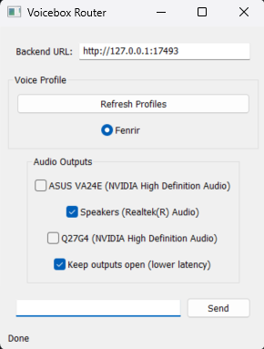

# Voicebox Router

A tiny, portable Windows GUI that types text → generates speech through a
locally-running [Voicebox](https://voicebox.sh/) backend → plays the result
straight to whichever audio output(s) you pick (VB-Cable, your headset, the
default Windows speakers — any combination, simultaneously).



## Why this exists

[Voicebox](https://voicebox.sh/) is a genuinely great local, open-source TTS
app — but its desktop client always plays generated audio through the
default Windows output device, with no way to route it elsewhere. That's a
problem if you want to send a cloned voice into Discord, a game, OBS, or any
other app expecting a specific input device (e.g. via
[VB-Cable](https://vb-audio.com/Cable/)).

This app is a **stopgap**, not a replacement: it's a minimal front-end that
talks to the same local Voicebox backend over its REST API, and adds the one
thing missing — picking *where* the audio goes. If/when Voicebox adds
native output routing, this project stops being necessary.

## Features

- Type text, hit **Enter**, hear it — no dialogs, no extra clicks.
- Play generated speech to **multiple audio outputs at once** (e.g. a
  virtual cable *and* your headphones, so you can monitor what a bot/game
  hears).
- Every active Windows playback device is listed automatically, with a
  checkbox to enable/disable it.
- Optional **"keep outputs open"** mode keeps the selected audio streams
  initialized between messages for near-instant playback, at the cost of a
  small amount of idle resource usage.
- Fully portable: a single `.exe` plus a `vbedb.json` settings file dropped
  next to it. No installer, no registry entries.
- No C/C++ toolchain required to build — pure Go, including the Windows
  audio (WASAPI) plumbing.

## Requirements

- Windows 10/11.
- A running local [Voicebox](https://docs.voicebox.sh/overview/installation)
  installation (its backend defaults to `http://127.0.0.1:17493`).
- At least one voice profile already set up in Voicebox (you'll need its
  Profile ID).

## Using the app

1. Launch Voicebox (or its backend) so it's listening locally.
2. Launch `vbrouter.exe`.
3. Fill in:
   - **Profile ID** — the voice profile to use.
   - **Backend URL** — defaults to `http://127.0.0.1:17493`; change it if
     your Voicebox backend runs elsewhere.
4. Under **Audio Outputs**, check every device you want the speech sent to
   (e.g. `CABLE Input (VB-Audio Virtual Cable)` and your normal speakers).
5. Type in the text box and press **Enter** (or click **Send**).

All of the above is remembered automatically in `vbedb.json`, written next
to the executable, so it's ready to go next time you open it.

## Building from source

```powershell
go build -o vbrouter.exe .
```

That's it — no cgo, no MinGW/MSVC required. The only non-standard build step
is that a Windows manifest (`app.manifest`) requesting Common Controls v6 is
pre-compiled into [`rsrc_windows_amd64.syso`](rsrc_windows_amd64.syso), which
`go build` picks up automatically. You only need to regenerate that file if
you change `app.manifest`:

```powershell
go install github.com/akavel/rsrc@latest
rsrc -manifest app.manifest -o rsrc_windows_amd64.syso
```

## How it works

1. `POST {backend_url}/generate` with the profile ID and text.
2. `GET {backend_url}/audio/{generation_id}` to fetch the resulting WAV.
3. Decode the WAV to PCM and resample it to match each selected output
   device's native format.
4. Feed the PCM into a WASAPI shared-mode render stream per selected device,
   via pure-Go COM bindings ([`go-wca`](https://github.com/moutend/go-wca)) —
   no cgo, no bundled native libraries.

See [`implementation-plan.md`](implementation-plan.md) for the full design
notes.

## Known limitations

- Windows-only (the whole point is Windows audio device routing).
- Assumes the backend returns WAV audio.
- Channel conversion (e.g. mono → stereo) is a simple duplication/average,
  not a proper mixing matrix — fine for spoken word, not meant for music.
- Not affiliated with or endorsed by the Voicebox project — this is a
  personal, independent client of its public local API.

## License

No license has been chosen yet for this project.
